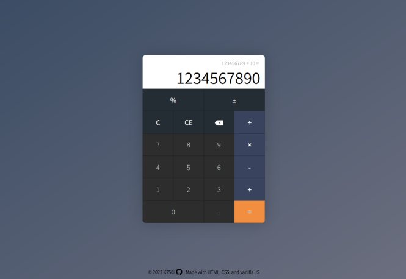

# Simple Calculator

The Simple Calculator is a basic calculator that performs addition, subtraction, multiplication, and division, along with some additional functionalities. It can be used through the user interface or with the keyboard. Visit the [page](https://k750i.github.io/calculator_odin/) for a demo of this project.

## Keyboard Shortcuts

- Use the number keys on your keyboard to enter numbers.
- Press "+" to select addition.
- Press "-" to select subtraction.
- Press "*" to select multiplication.
- Press "/" to select division.
- Press "%" to select percentage.
- Press "Enter" to calculate the result.
- Press "Backspace" to delete a number.
- Press "Esc" to clear all.

## License

This project is licensed under the MIT License. See the [LICENSE](./LICENSE) file for details.

## Acknowledgments

This calculator was created as part of an assignment for the Foundations Course of [The Odin Project](https://www.theodinproject.com).
